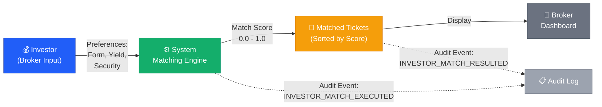
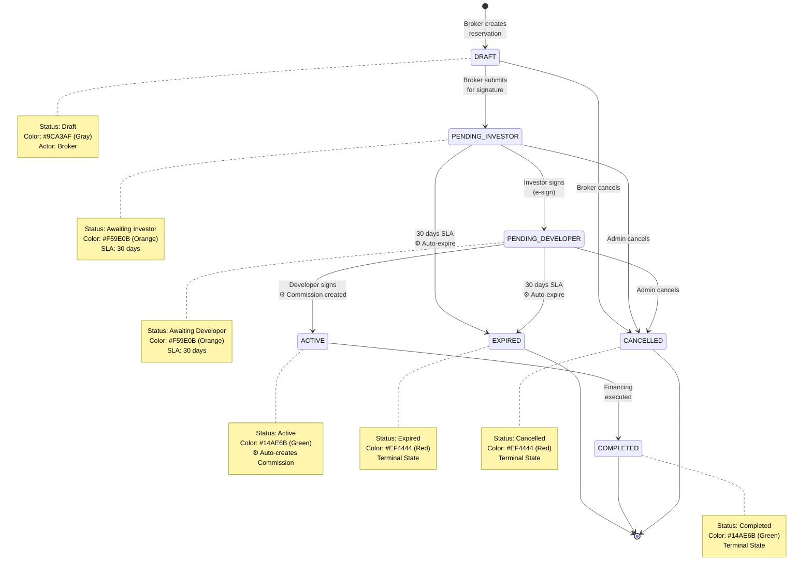
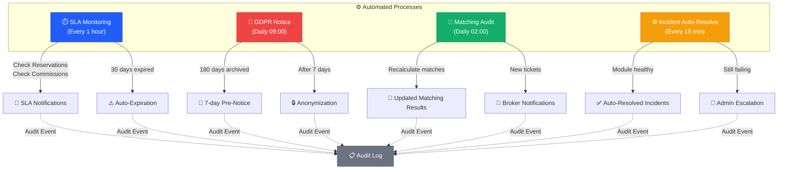
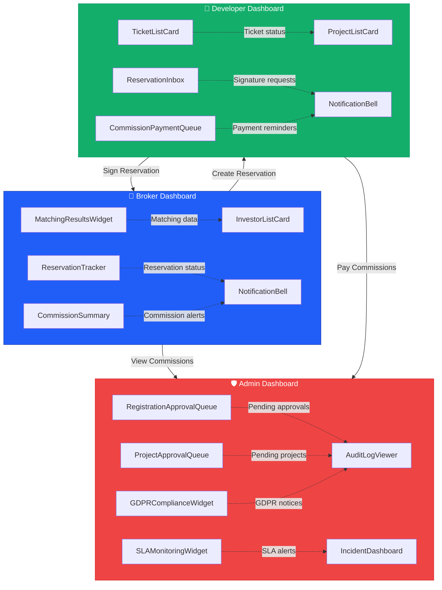
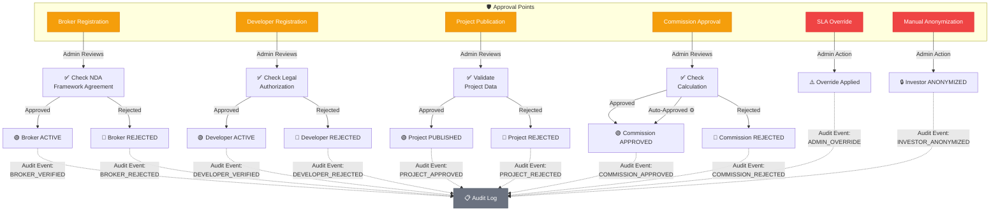

# Tipari.cz — Functional Blueprint Visuals

**Version:** 0.3 (Visual Draft)  
**Generated:** 2026-01-17  
**Source:** Tipari_Functional_Blueprint.md (v0.2)  
**Author:** Figma AI (SystemCore Workflow)  
**Audit Marker:** `FUNCTIONAL_BLUEPRINT_VISUALIZED`

---

## Document Purpose

Tento dokument obsahuje všechny vizuální diagramy procesů platformy Tipari.cz. Každý diagram je poskytnut v **Mermaid syntaxi** (zobrazitelné v GitHub, Notion, VS Code) a také s **Figma specifikacemi** pro profesionální implementaci.

---

## 🎨 Design System Reference

### Barevná paleta Tipari

```css
--primary-blue: #215EF8    /* Akce, odkazy */
--success-green: #14AE6B   /* Úspěch, active stavy */
--warning-orange: #F59E0B  /* Varování, pending stavy */
--error-red: #EF4444       /* Chyby, cancelled stavy */
--neutral-gray: #6B7280    /* Text, bordery */
--light-gray: #9CA3AF      /* Draft, disabled stavy */
--background: #F9FAFB      /* Pozadí canvasu */
```

### Typografie

- **Headings:** Manrope Bold (600-700)
- **Body:** Manrope Regular (400-500)
- **Labels:** Inter Medium (500)

### Grid System

- **Grid:** 8px
- **Auto-layout:** Enabled
- **Spacing:** Multiples of 8px (8, 16, 24, 32, 40, 48)

---

## Frame #1: Investor Matching Flow

### Mermaid Diagram



### Figma Specifications

**Frame Properties:**
- Size: 1200 × 400 px
- Background: #F9FAFB
- Corner radius: 8px
- Padding: 32px

**Node Specifications:**

| Element | Shape | Size | Fill | Stroke | Icon |
|---------|-------|------|------|--------|------|
| Investor | Rectangle | 180 × 120 | #215EF8 | #1E40AF (2px) | 💰 (32px) |
| Matching Engine | Rectangle | 180 × 120 | #14AE6B | #059669 (2px) | ⚙️ (32px) |
| Matched Tickets | Rectangle | 180 × 120 | #F59E0B | #D97706 (2px) | 🎯 (32px) |
| Broker Dashboard | Rectangle | 180 × 120 | #6B7280 | #4B5563 (2px) | 🧩 (32px) |
| Audit Log | Rectangle | 160 × 80 | #9CA3AF | #6B7280 (1px dashed) | 📋 (24px) |

**Edge Labels:**
- Font: Inter Medium 12px
- Color: #4B5563
- Background: #FFFFFF with 2px padding
- Arrows: 2px solid, matching source node color

**Corner Label:**
*"SystemCore v3.8.1 – Functional Blueprint Visuals – Generated 2026-01-17"*  
Font: Inter Regular 10px, Color: #9CA3AF

---

## Frame #2: Reservation Lifecycle

### Mermaid Diagram



### Figma Specifications (Swimlane Format)

**Frame Properties:**
- Size: 1400 × 800 px
- Background: #F9FAFB
- Layout: Horizontal swimlanes

**State Boxes:**

| State | Fill | Stroke | Size | Position |
|-------|------|--------|------|----------|
| **DRAFT** | #9CA3AF | #6B7280 (2px) | 200 × 100 | Row 1 |
| **PENDING_INVESTOR** | #F59E0B | #D97706 (2px) | 200 × 100 | Row 2 |
| **PENDING_DEVELOPER** | #F59E0B | #D97706 (2px) | 200 × 100 | Row 2 |
| **ACTIVE** | #14AE6B | #059669 (2px) | 200 × 100 | Row 3 |
| **COMPLETED** | #14AE6B | #059669 (2px) | 200 × 100 | Row 4 |
| **EXPIRED** | #EF4444 | #DC2626 (2px) | 200 × 100 | Row 4 |
| **CANCELLED** | #EF4444 | #DC2626 (2px) | 200 × 100 | Row 4 |

**Transitions:**
- Arrow style: 2px solid with 8px arrowhead
- Labels: Inter Medium 11px, #4B5563
- Dashed arrows for auto-transitions: 2px dashed

**SLA Indicators:**
- Add clock icon ⏱️ (24px) next to PENDING states
- Label: "30 days" in warning box (#FEF3C7 background, #D97706 text)

**Auto-process Indicators:**
- Add ⚙️ icon (20px) next to auto-transitions
- Label: "Auto" in green box (#D1FAE5 background, #059669 text)

---

## Frame #3: Commission Workflow

### Mermaid Diagram

```mermaid
graph TD
    A["🟢 Reservation<br/>ACTIVE"] -->|⚙️ Auto-create| B["💼 Commission<br/>CREATED"]
    B -->|⚙️ Calculate<br/>Amount + Split| C["💼 Commission<br/>PENDING"]
    C -->|Admin<br/>Approval| D["💼 Commission<br/>APPROVED"]
    D -->|Developer<br/>Payment<br/>(30 days)| E["🏦 Commission<br/>PAID TO PLATFORM"]
    E -->|Platform<br/>Payout<br/>(3 days)| F["✅ Commission<br/>PAID TO BROKER"]
    F -->|Archive| G["📋 Audit Trail<br/>CLOSED"]
    
    C -.->|Admin<br/>Rejects| H["❌ Commission<br/>REJECTED"]
    D -.->|Payment<br/>Overdue| I["⚠️ Escalation<br/>to Admin"]
    
    style A fill:#14AE6B,stroke:#059669,color:#fff
    style B fill:#215EF8,stroke:#1E40AF,color:#fff
    style C fill:#F59E0B,stroke:#D97706,color:#fff
    style D fill:#14AE6B,stroke:#059669,color:#fff
    style E fill:#215EF8,stroke:#1E40AF,color:#fff
    style F fill:#14AE6B,stroke:#059669,color:#fff
    style G fill:#6B7280,stroke:#4B5563,color:#fff
    style H fill:#EF4444,stroke:#DC2626,color:#fff
    style I fill:#F59E0B,stroke:#D97706,color:#fff
```

### Figma Specifications (Circular Process)

**Frame Properties:**
- Size: 900 × 900 px
- Background: #F9FAFB
- Layout: Circular arrangement (clockwise)

**Circle Arrangement:**
- Center point: (450, 450)
- Radius: 280px
- 7 nodes evenly distributed (51.4° apart)

**Node Specifications:**

| State | Icon | Fill | Size | Angle |
|-------|------|------|------|-------|
| Reservation Active | 🟢 | #14AE6B | 120 × 120 | 0° (top) |
| Commission Created | 💼 | #215EF8 | 120 × 120 | 51.4° |
| Commission Pending | 💼 | #F59E0B | 120 × 120 | 102.8° |
| Commission Approved | 💼 | #14AE6B | 120 × 120 | 154.2° |
| Paid to Platform | 🏦 | #215EF8 | 120 × 120 | 205.6° |
| Paid to Broker | ✅ | #14AE6B | 120 × 120 | 257° |
| Audit Trail Closed | 📋 | #6B7280 | 120 × 120 | 308.4° |

**SLA Labels (Inside Circle):**
- Position: Center of circle
- **"30 days"** — between Approved → Paid to Platform (orange #F59E0B)
- **"3 days"** — between Paid to Platform → Paid to Broker (blue #215EF8)
- Font: Manrope Bold 24px

**Rejection/Escalation Nodes:**
- Position: Outside main circle
- Size: 100 × 100
- Dashed connection lines

---

## Frame #4: Automated Processes Overview

### Mermaid Diagram



### Figma Specifications

**Frame Properties:**
- Size: 1200 × 900 px
- Background: #F9FAFB
- Layout: Top section (4 cron boxes) → Bottom section (outputs)

**Cron Process Boxes:**

| Process | Icon | Fill | Size | Schedule Label |
|---------|------|------|------|----------------|
| SLA Monitoring | ⏱️ | #215EF8 | 250 × 140 | "Every 1 hour" |
| GDPR Notice | 🔐 | #EF4444 | 250 × 140 | "Daily 09:00" |
| Matching Audit | 🧠 | #14AE6B | 250 × 140 | "Daily 02:00" |
| Incident Auto-Resolve | ⚙️ | #F59E0B | 250 × 140 | "Every 15 min" |

**Output Nodes:**
- Size: 180 × 100
- Rounded corners: 8px
- Icon size: 24px
- Font: Inter Medium 12px

**Connection Lines:**
- Solid for primary flow: 2px
- Dashed for audit events: 1px dashed
- Color matches source node

**Frequency Labels:**
- Position: Top-right corner of each cron box
- Background: rgba(255, 255, 255, 0.9)
- Padding: 4px 8px
- Border radius: 4px
- Font: Inter Bold 10px

---

## Frame #5: Role & Permissions Matrix

### Table Format

| Action | 🧑‍💼 Broker | 🏢 Developer | 🛡️ Admin | Automation |
|--------|-------------|--------------|----------|------------|
| **Registrace účtu** | 🟢 Self-register | 🟢 Self-register | 🟢 Full access | ⚙️ Validation |
| **Přidání investora** | 🟢 Full (own) | 🔴 No access | 🟢 Full (all) | ⚙️ Auto-matching |
| **Vytvoření projektu** | 🔴 Read-only | 🟢 Full (own) | 🟢 Full (all) | — |
| **Vytvoření tiketu** | 🔴 Read-only | 🟢 Full (own) | 🟢 Full (all) | ⚙️ Auto-matching |
| **Vytvoření rezervace** | 🟢 Full (own) | 🔴 Read-only | 🟢 Full (all) | — |
| **Podpis rezervace** | 🔴 No access | 🟢 Sign (related) | 🟢 Override | ⚙️ Commission created |
| **Schválení provize** | 🔴 Read-only | 🔴 Read-only | 🟢 Approve/Reject | ⚙️ Auto-approve (std) |
| **Platba provize** | 🔴 No access | 🟢 Pay (own) | 🟢 Monitor | — |
| **Výplata provize** | 🔴 View status | 🔴 No access | 🟢 Manual override | ⚙️ Auto-payout |
| **Matching results** | 🟢 View (own) | 🔴 No access | 🟢 View (all) | ⚙️ Auto-generated |
| **GDPR export** | 🟢 Export (own) | 🔴 No access | 🟢 Export (all) | ⚙️ Auto-logged |
| **Audit log** | 🟠 Own actions | 🟠 Own actions | 🟢 Full access | ⚙️ Auto-generated |
| **SLA override** | 🔴 No access | 🔴 No access | 🟢 Full control | — |
| **Incident řešení** | 🔴 No access | 🔴 No access | 🟢 Resolve | ⚙️ Auto-resolve |

### Figma Specifications

**Frame Properties:**
- Size: 1400 × 800 px
- Background: #FFFFFF
- Border: 1px solid #E5E7EB
- Padding: 24px

**Table Structure:**
- Header row: #F3F4F6 background, Manrope Bold 14px
- Body rows: Alternating #FFFFFF / #F9FAFB
- Cell padding: 12px 16px
- Row height: 56px

**Permission Icons:**

| Icon | Meaning | Color | Background |
|------|---------|-------|------------|
| 🟢 | Full Access | #14AE6B | #D1FAE5 (light green) |
| 🟠 | Partial Access | #F59E0B | #FEF3C7 (light orange) |
| 🔴 | Read-only / No Access | #EF4444 | #FEE2E2 (light red) |
| ⚙️ | Automated | #215EF8 | #DBEAFE (light blue) |

**Icon Size:** 20px with 4px padding in rounded rectangle (16px radius)

**Legend (Bottom-right):**
- Size: 300 × 120
- Background: #F9FAFB
- Border: 1px solid #E5E7EB
- Padding: 16px

---

## Frame #6: UX Interaction Layer

### Mermaid Diagram



### Figma Specifications

**Frame Properties:**
- Size: 1600 × 1000 px
- Background: #F9FAFB
- Layout: 3 columns (Broker | Developer | Admin)

**Dashboard Containers:**

| Dashboard | Background | Border | Size | Position |
|-----------|------------|--------|------|----------|
| Broker | #215EF8 (10% opacity) | 2px solid #215EF8 | 480 × 900 | Left |
| Developer | #14AE6B (10% opacity) | 2px solid #14AE6B | 480 × 900 | Center |
| Admin | #EF4444 (10% opacity) | 2px solid #EF4444 | 480 × 900 | Right |

**Widget Cards:**
- Size: 440 × 140 (fits inside dashboard with 20px margin)
- Background: #FFFFFF
- Border radius: 8px
- Shadow: 0px 2px 8px rgba(0, 0, 0, 0.08)
- Padding: 16px
- Vertical spacing: 16px

**Widget Headers:**
- Font: Manrope Bold 14px
- Color: Match dashboard color
- Icon: 24px, left-aligned

**Notification Bell:**
- Position: Top-right of each dashboard
- Size: 40 × 40
- Badge: Red circle with white text (unread count)
- Icon: 🔔 (24px)

**Connection Arrows:**
- Solid for data flow: 2px, matching source dashboard color
- Dashed for notifications: 1px dashed, #6B7280

---

## Frame #7: Governance Hooks

### Mermaid Diagram



### Figma Specifications

**Frame Properties:**
- Size: 1600 × 1000 px
- Background: #F9FAFB
- Layout: Left section (Approval Points) → Right section (Outcomes + Audit)

**Approval Point Boxes:**

| Approval Point | Icon | Fill | Size | Auto-Approve? |
|----------------|------|------|------|---------------|
| Broker Registration | 🛡️ | #F59E0B | 200 × 100 | ❌ Manual |
| Developer Registration | 🛡️ | #F59E0B | 200 × 100 | ❌ Manual |
| Project Publication | 🛡️ | #F59E0B | 200 × 100 | ❌ Manual |
| Commission Approval | 🛡️ | #F59E0B | 200 × 100 | ✅ For standard |
| SLA Override | 🛡️ | #EF4444 | 200 × 100 | ❌ Manual |
| Manual Anonymization | 🛡️ | #EF4444 | 200 × 100 | ❌ Manual |

**Review Process Boxes:**
- Size: 180 × 120
- Background: #FFFFFF
- Border: 2px solid #E5E7EB
- Icon: ✅ (32px)
- Font: Manrope Medium 12px

**Outcome Boxes:**

| Outcome | Fill | Icon | Size |
|---------|------|------|------|
| Approved | #D1FAE5 | 🟢 | 160 × 80 |
| Rejected | #FEE2E2 | 🔴 | 160 × 80 |
| Override | #FEF3C7 | ⚠️ | 160 × 80 |
| Anonymized | #E5E7EB | 🔒 | 160 × 80 |

**Audit Log Connection:**
- Position: Bottom-right
- Size: 300 × 200
- Dashed lines from all outcomes
- Icon: 📋 (48px)
- Label: "All governance actions generate audit events"

---

## Export & Implementation Guide

### For GitHub/Notion Users

All Mermaid diagrams in this document are **render-ready** in:
- ✅ GitHub README.md files
- ✅ Notion pages (paste as code block with language "mermaid")
- ✅ VS Code with Mermaid extension
- ✅ GitLab, Bitbucket, Azure DevOps

### For Figma Designers

**Step-by-step implementation:**

1. **Create Figma file:** `Tipari_Functional_Blueprint_Visuals.fig`
2. **Create 7 frames** (one for each diagram)
3. **Use specifications above** for exact sizing, colors, and typography
4. **Import icons** from Figma community or use Unicode emojis
5. **Apply color palette** from Design System section
6. **Add metadata label** to top-right corner of each frame

**Recommended Figma Plugins:**
- **Autoflow** — for creating connection arrows
- **Mermaid Chart** — for importing Mermaid directly
- **Iconify** — for icon library

### For Developers

**Export formats available:**
- **SVG** — from Mermaid live editor (https://mermaid.live)
- **PNG** — high-resolution export for documentation
- **PDF** — for printing and presentations

---

## Metadata Summary

| Parameter | Value |
|-----------|-------|
| **Document Version** | 0.3 (Visual Draft) |
| **Generated** | 2026-01-17 |
| **Source** | Tipari_Functional_Blueprint.md (v0.2) |
| **Diagrams** | 7 complete visualizations |
| **Format** | Mermaid + Figma specs |
| **Status** | Ready for implementation |
| **Audit Marker** | `FUNCTIONAL_BLUEPRINT_VISUALIZED` |

---

## Change Log

| Version | Date | Changes | Author |
|---------|------|---------|--------|
| 0.3 | 2026-01-17 | Initial visual draft with 7 diagrams | Figma AI |

---

**© 2026 Tipari.cz — Functional Blueprint Visuals**  
*SystemCore v3.8.1 — Process Visualization Layer*  
*All diagrams derived from locked Business Specification v1.1*
